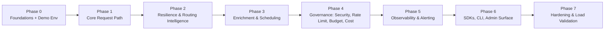
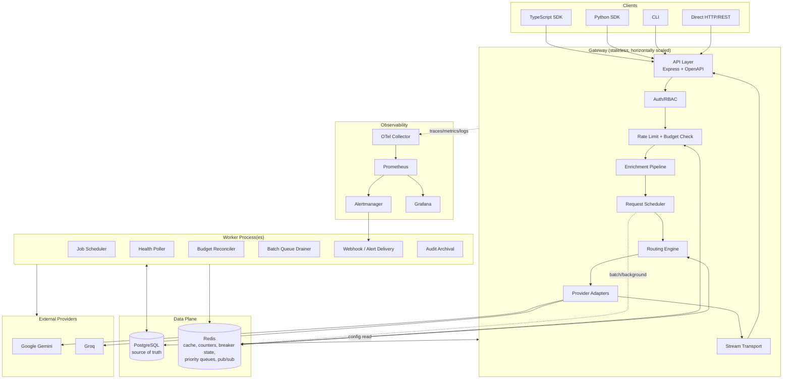
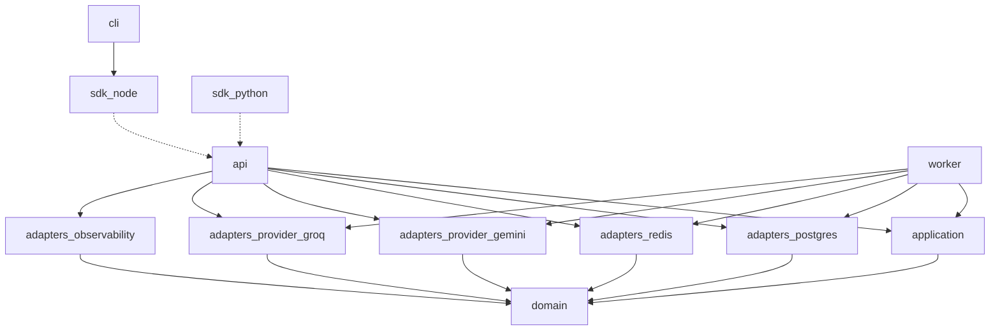
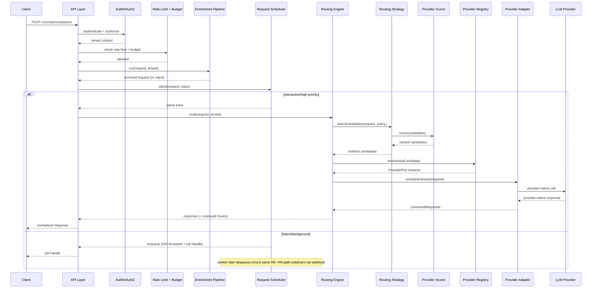
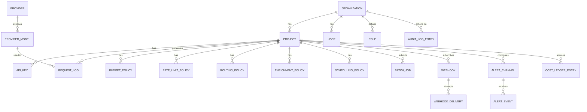

# Enterprise Multi-Provider LLM Gateway — Architecture & Implementation Blueprint

Scope: Complete architecture and phased implementation plan for the LLM Gateway. This document
captures the design rationale; the runnable code lives in `packages/`.

---

## Table of Contents

1. [Executive Summary](#1-executive-summary)
2. [Core Architectural Commitments](#2-core-architectural-commitments)
3. [Phased Delivery Roadmap](#3-phased-delivery-roadmap)
4. [High-Level Architecture](#4-high-level-architecture)
5. [Folder & Package Structure](#5-folder--package-structure)
6. [Domain Model](#6-domain-model)
7. [Configuration Service](#7-configuration-service)
8. [Provider Abstraction](#8-provider-abstraction)
9. [Request Lifecycle & Routing Engine](#9-request-lifecycle--routing-engine)
10. [Request Enrichment Pipeline](#10-request-enrichment-pipeline)
11. [Request Scheduling & Priority Queue](#11-request-scheduling--priority-queue)
12. [Security Architecture](#12-security-architecture)
13. [Rate Limiting & Budget Enforcement](#13-rate-limiting--budget-enforcement)
14. [Cost Engine](#14-cost-engine)
15. [Resilience Architecture](#15-resilience-architecture)
16. [Streaming Architecture](#16-streaming-architecture)
17. [Observability & Alerting](#17-observability--alerting)
18. [Data Model](#18-data-model)
19. [Background Workers & Job Scheduling](#19-background-workers--job-scheduling)
20. [API Architecture](#20-api-architecture)
21. [SDK & CLI Architecture](#21-sdk--cli-architecture)
22. [Error Handling & Testing Strategy](#22-error-handling--testing-strategy)
23. [Deployment & Scaling](#23-deployment--scaling)
24. [Demo Environment & Seed Data](#24-demo-environment--seed-data)
25. [Trade-offs & Future Extensibility](#25-trade-offs--future-extensibility)
26. [Architecture Decision Records](#26-architecture-decision-records)

---

## 1. Executive Summary

The Gateway is a stateless, horizontally-scalable Node.js/TypeScript service sitting between
client applications and multiple LLM providers (initially Google Gemini and Groq). Applications
talk only to the Gateway. It owns authentication, authorization, request enrichment, scheduling,
intelligent routing, streaming, rate limiting, budget/cost tracking, resilience (retries, circuit
breakers, failover), and observability (tracing, metrics, logging, alerting) — while remaining
completely provider-agnostic at its core.

Built on **Hexagonal (Ports & Adapters) / Clean Architecture** with **Domain-Driven Design** and
**SOLID** principles throughout: the domain and application layers never import a provider SDK, a
Postgres client, or a Redis client. They depend only on interfaces ("ports"); infrastructure
adapters implement those interfaces in outer layers. Everything that varies by provider,
persistence technology, or deployment target is isolated behind an adapter — the business logic
that decides *who gets rate-limited, what gets routed where, what it costs, and what gets logged*
never changes when a provider is added or a database is swapped.

---

## 2. Core Architectural Commitments

These hold across every subsystem in this document:

- **Hexagonal / Clean Architecture.** `domain` and `application` packages depend on nothing but
  ports. All infrastructure (Postgres, Redis, provider SDKs, HTTP/Express, OpenTelemetry
  exporters) lives behind adapters.
- **Provider agnosticism.** No subsystem outside `adapters-provider-*` knows Gemini or Groq
  exist. Adding a provider = implement `ProviderPort` + add a `ProviderCatalog` entry (config) +
  register the adapter. Nothing in routing, billing, security, or observability changes.
- **Configuration-driven, zero-restart.** Routing strategy/weights, rate limits, budgets,
  enrichment policy, scheduling weights, and provider enable/disable are all runtime config read
  through the `ConfigurationService`. No subsystem reads Postgres directly for config.
- **No unnecessary infrastructure.** No Kafka/RabbitMQ/NATS, no Elasticsearch, no
  Kubernetes-specific coupling, no service mesh. Postgres + Redis cover durability, caching,
  distributed state, priority queueing, and job scheduling at this system's scale. Every point
  where a heavier dependency might eventually be justified is called out explicitly in
  [Section 25](#25-trade-offs--future-extensibility) rather than pre-built speculatively.
- **Independent testability.** Every port can be faked in a unit test; every adapter has its own
  contract test suite; the API layer has integration tests; critical flows have e2e tests.
- **Zero trust, least privilege.** Every endpoint validates input, authenticates, authorizes, and
  scopes to tenant — assuming no implicit trust between layers.
- **Backward-compatible, idempotent where it matters.** Public APIs version additively; mutating
  admin operations accept idempotency keys; provider retries carry idempotency keys where the
  provider supports them.

---

## 3. Phased Delivery Roadmap

Each phase is independently shippable and testable. No later phase requires re-architecting an
earlier one — that is the acceptance test for "provider agnostic" and "config driven."



### Phase 0 — Foundations
- Monorepo scaffold (pnpm workspaces): `domain`, `application`, `adapters-postgres`,
  `adapters-redis`, `adapters-provider-gemini`, `adapters-provider-groq`, `api`, `worker`,
  `sdk-node`, `sdk-python`, `cli`.
- Postgres schema (Prisma) + migrations for tenancy (Organization/Project/User/ApiKey/Role).
- `ConfigurationService` port + Postgres-backed implementation, Redis cache, pub/sub invalidation
  — built first because routing, rate limits, budgets, enrichment policy, and provider enablement
  all read through it, never through Postgres directly.
- Docker Compose dev environment (gateway, worker, Postgres, Redis, Prometheus, Grafana,
  Alertmanager).
- Demo environment & seed data (Section 24), runnable via `docker compose up && make seed`.
- **Exit criteria**: a config value changed in Postgres propagates to a running instance with
  zero restart; `make seed` produces an immediately callable, demoable gateway.

### Phase 1 — Core Request Path
- Domain model + core entities.
- `ProviderPort` interface; Gemini and Groq adapters (non-streaming first).
- `ProviderCatalog` (static capability/pricing metadata) and `ProviderRegistry` (runtime adapter
  lookup) — two components from day one.
- `RoutingEngine` with a single Manual/explicit-provider strategy — proves the end-to-end path
  before scoring exists.
- JWT + API key authentication, org/project scoping middleware.
- **Exit criteria**: a client authenticates, gets routed to Gemini or Groq, receives a normalized
  response.

### Phase 2 — Resilience & Routing Intelligence
- `ProviderScorer` + remaining `RoutingStrategy` implementations (RoundRobin, Weighted,
  HealthAware, StickySession).
- Health monitoring (active + passive) feeding the Scorer.
- Retry policy (backoff + jitter + idempotency keys).
- Circuit breaker (per provider+model, Redis-shared state machine).
- Failover (RoutingEngine re-invocation excluding tripped/unhealthy providers).
- Shadow traffic (mirrored sampled requests, response discarded, metrics captured).
- Streaming: `StreamTransport` port, SSE implementation.
- **Exit criteria**: forcing a provider failure triggers automatic failover within a bounded
  retry window with no client-facing error, visible in metrics.

### Phase 3 — Request Enrichment & Scheduling
- `RequestEnrichmentPipeline`: ordered, config-driven stages — `SystemPromptInjectionStage`,
  `CompliancePolicyStage`, `ContentFilterStage` (delegating to a pluggable
  `ContentModerationPort`, default no-op).
- `RequestScheduler`: request-class admission (`INTERACTIVE`, `HIGH_PRIORITY`, `BATCH`,
  `BACKGROUND`), concurrency-aware inline admission for interactive/high-priority, Redis
  priority-queue enqueue for batch/background, worker-pool drain via the `JobScheduler`
  abstraction.
- Batch API surface: `202 Accepted` + job handle, `GET /v1/batches/{id}`,
  webhook-on-completion.
- **Exit criteria**: an interactive request completes synchronously under load while a batch
  request is accepted, queued, processed asynchronously, and delivered via webhook — without
  starving interactive traffic.

### Phase 4 — Governance: Security, Rate Limiting, Budget, Cost
- RBAC (roles/permissions at org and project scope).
- Immutable audit log (append-only, admin-operation coverage).
- Secret management: envelope-encrypted provider credentials, rotation workflow.
- Request signing (HMAC) for SDK-to-gateway integrity (optional per project).
- `RateLimitAlgorithm` port + Redis Token Bucket implementation.
- `CostEngine`: pricing tables, usage→cost calculation, cost ledger.
- Budget enforcement: Postgres ledger + Redis fast-path counters, reconciled by a background job.
- **Exit criteria**: a project with a budget and a rate limit is hard-stopped at both, with a
  full audit trail of policy changes.

### Phase 5 — Observability & Alerting
- OpenTelemetry spans across the full request path (including Enrichment and Scheduler stages).
- Prometheus `/metrics`, Grafana dashboards provisioned as JSON.
- Structured JSON logs, correlated by trace ID, with secret/PII redaction.
- Health/Ready/Live/Version endpoints.
- Alerting: Prometheus Alertmanager rules for latency SLO breach, elevated error rate, sustained
  rate-limit rejection; an `AlertPublisher` port used directly by Budget Enforcement, Circuit
  Breaker, and Health Monitor to emit `DomainAlertEvent`s for immediate (non-scrape-delayed)
  notification via the Webhook delivery worker; both paths share a pluggable `AlertChannel` port.
- **Exit criteria**: a request traces end-to-end; a synthetic budget-threshold breach and a
  synthetic circuit-breaker trip both produce an alert within seconds, independent of the
  Prometheus scrape interval.

### Phase 6 — SDKs, CLI, Admin Surface
- TypeScript SDK, Python SDK (typed HTTP clients, streaming iterators, typed error mapping).
- CLI (provider/config/routing/budget/enrichment-policy management via the Admin API — no direct
  DB access).
- Admin API (routing policy, rate limits, budgets, enrichment policy, scheduling weights,
  provider enable/disable, webhooks, alert channels).
- Public API (chat/completion, streaming, batch submission, models list) + OpenAPI/Swagger.
- `JobScheduler` port + Postgres-backed implementation (shared by budget reconciliation, health
  polling, webhook delivery, audit archival, batch draining).
- **Exit criteria**: an operator manages the entire system — providers, routing, budgets,
  enrichment, alerting — through the CLI/Admin API alone.

### Phase 7 — Hardening & Load Validation
- k6 load tests: steady-state, spike, soak, failover-under-load, batch-queue-under-load.
- Jest suite completeness: unit (domain/application), contract (adapters), integration (API),
  e2e (critical flows).
- OWASP API Security Top 10 review pass.
- **Exit criteria**: defined SLOs (p99 gateway overhead, failover time, availability, queue drain
  latency) validated under k6, reports checked into the repo.

---

## 4. High-Level Architecture



---

## 5. Folder & Package Structure

**Purpose**: enforce the hexagonal boundary at the filesystem/package level so a dependency
violation (e.g. `domain` importing a Postgres client) is a build error, not a code-review catch.

**Monorepo tool**: pnpm workspaces. No Nx/Turborepo — the package count and build graph don't
justify the added tooling surface yet (see [ADR-0002](#26-architecture-decision-records)).

```
llm-gateway/
├── packages/
│   ├── domain/                  # entities, value objects, domain services, port interfaces — zero infra deps
│   ├── application/             # use-cases/orchestration (routing, enrichment, scheduling, budget) — depends only on domain ports
│   ├── adapters-postgres/       # Prisma schema, repositories implementing domain repository ports
│   ├── adapters-redis/          # rate limiter, circuit breaker state, priority queue, config cache implementations
│   ├── adapters-provider-gemini/
│   ├── adapters-provider-groq/
│   ├── adapters-observability/  # OTel, Prometheus, structured logging adapters
│   ├── api/                     # Express app: HTTP layer, DTO validation, OpenAPI spec — composition root
│   ├── worker/                  # background worker process — composition root for JobScheduler handlers
│   ├── sdk-node/                # published TypeScript SDK
│   ├── sdk-python/              # published Python SDK (separate toolchain, poetry/uv)
│   └── cli/                     # operator CLI, wraps Admin + Public APIs
├── docker/                      # Dockerfiles per package, Compose overlays (dev/demo/prod-like)
├── docs/architecture/           # (optional) this blueprint split into topic files, if/when needed
├── prisma/                      # schema.prisma, migrations, seed script
└── k6/                          # load test scripts
```

**Package dependency graph** (arrows = "depends on"):



`domain` has zero outgoing edges to any `adapters-*` package — enforced by a lint rule
(`import/no-restricted-paths` or equivalent) checked in CI, not just convention.

**Layered architecture**:

| Layer | Package(s) | Knows about |
|---|---|---|
| Domain | `domain` | Entities, value objects, port interfaces. Nothing else. |
| Application | `application` | Domain + ports. Orchestrates use-cases (RouteRequest, EnforceBudget, EnrichRequest). No HTTP, no SQL, no Redis client. |
| Infrastructure (adapters) | `adapters-*` | Domain ports (implements them) + one specific technology (Postgres, Redis, a provider SDK). |
| Interface (composition roots) | `api`, `worker` | Wires adapters to application use-cases via dependency injection at startup. Only place concrete adapter classes are instantiated. |
| Delivery | `sdk-node`, `sdk-python`, `cli` | The public HTTP contract only — never the internals above. |

**Design patterns used**: Ports & Adapters (Hexagonal), Dependency Injection (constructor
injection, wired at the composition root — no service locator, no DI framework magic beyond
what's needed for testability).

**Failure scenarios**: a package boundary violation (e.g., `application` importing
`@prisma/client`) fails CI via lint + a dependency-graph check (e.g., `dependency-cruiser`),
not silently shipped.

**Future extensibility**: a new package (`adapters-provider-openai`) is additive; no existing
package's dependency graph changes.

---

## 6. Domain Model

**Purpose**: represent the business concepts the Gateway governs, independent of how they're
persisted or exposed.

**Core entities**:

- **Organization** — top-level tenant. Owns Projects, Users, org-level policy defaults.
- **Project** — scoping unit under an Organization. Owns ApiKeys, project-level policy overrides.
- **User** — human identity, JWT-authenticated, has Roles per Organization/Project.
- **ApiKey** — machine identity, hashed + prefixed, scoped to a Project, has Roles.
- **Role / Permission** — RBAC primitives; roles bind permissions at org or project scope.
- **Provider** — registered provider (Gemini, Groq, ...), enable/disable flag, credential
  reference.
- **ProviderModel** — a model exposed by a Provider, capability + pricing metadata.
- **RoutingPolicy** — strategy selection + weights, scoped to org/project/route.
- **RateLimitPolicy** — algorithm selection + thresholds, scoped to org/project/key.
- **BudgetPolicy** — period (daily/monthly), hard/soft limits, scoped to org/project.
- **EnrichmentPolicy** — ordered enrichment stage configuration, scoped to org/project.
- **SchedulingPolicy** — request-class weights/concurrency limits, scoped to org/project.
- **BatchJob** — a submitted batch/background request and its lifecycle state.
- **RequestLog** — per-request record: tenant, provider/model used, tokens, cost, latency,
  outcome.
- **AuditLogEntry** — immutable record of an administrative action.
- **Webhook / WebhookDelivery** — subscription + delivery attempt record.
- **AlertChannel / AlertEvent** — alert routing configuration + emitted alert record.
- **CircuitBreakerState** — logically owned by Resilience, persisted in Redis (domain models it
  as a value object even though the canonical store is not Postgres).

**Dependencies**: none outside the standard library and small pure-domain value types (Money,
TokenCount, TimeWindow). No ORM decorators, no HTTP types.

**Design patterns used**: Entity/Value Object distinction (DDD), Repository pattern (interfaces
only — `OrganizationRepository`, `ProjectRepository`, etc. — defined here, implemented in
`adapters-postgres`), Aggregate boundaries (Organization is the aggregate root for
org-scoped policy; Project is the aggregate root for project-scoped policy and ApiKeys).

**Failure scenarios**: invalid state transitions (e.g., a BudgetPolicy with a negative limit) are
rejected by domain invariants at construction time, not caught downstream.

**Future extensibility**: new policy types (e.g., a future `CachingPolicy`) are new entities with
their own repository port — no change to existing entities.

---

## 7. Configuration Service

**Purpose**: single authoritative access path for all dynamic configuration, so no subsystem
queries Postgres directly for config and no restart is ever required for a config change.

**Responsibilities**: serve current config values by scope (global/org/project), cache them,
invalidate the cache the moment an admin write happens, and expose a subscription mechanism for
subsystems that want to react to changes rather than poll.

**Public interface**:
```
interface ConfigurationService {
  get<T>(key: ConfigKey): Promise<T>
  getWithFallback<T>(key: ConfigKey, scope: TenantScope): Promise<T>   // project -> org -> global
  subscribe(key: ConfigKey, handler: (value: unknown) => void): Unsubscribe
}
```

**Dependencies**: `ConfigurationRepository` port (implemented by `adapters-postgres`), a
`DistributedCache` port (implemented by `adapters-redis`), a `PubSub` port (implemented by
`adapters-redis`).

**Implementation** (`PostgresConfigurationService`): Postgres is the write path and source of
truth; Redis holds a read-through cache keyed by `cfg:{scope}:{key}`; writes publish an
invalidation message on a Redis pub/sub channel, which every gateway/worker instance subscribes
to and uses to evict/refresh its cache. Sub-second propagation, no polling, no message broker.

**Consumers**: RoutingEngine (strategy/weights), RateLimiter (algorithm/thresholds), Budget
enforcement (limits), Enrichment Pipeline (stage config), Request Scheduler (class weights),
Provider enable/disable, CircuitBreaker thresholds, Alert routing rules.

**Design patterns used**: Cache-Aside with invalidation-via-pub/sub, Repository pattern, Observer
(the `subscribe` method).

**Scalability considerations**: read-heavy, write-rare — every gateway instance reads config on
nearly every request but admin config changes are infrequent; the cache-aside model means read
load never touches Postgres in the steady state.

**Failure scenarios**: Redis unavailable → fall back to direct (rate-limited) Postgres reads with
an in-process TTL cache; Postgres unavailable → serve last-known-good from Redis/in-process
cache and mark `/ready` degraded rather than failing every request.

**Future extensibility**: new config domains (e.g., a future `CachingPolicy`) are new `ConfigKey`
namespaces — no change to the service's interface or invalidation mechanism.

---

## 8. Provider Abstraction

**Purpose**: encapsulate everything provider-specific (auth, request/response shape, streaming
protocol, error codes, capabilities) so the rest of the system operates on canonical types only.

**Responsibilities**: translate canonical requests to provider-native calls and provider-native
responses/errors back to canonical types; expose what each provider/model can do without the
caller needing provider-specific knowledge; track which providers are currently enabled.

**Public interfaces**:
```
interface ProviderPort {
  readonly providerId: string
  complete(request: CanonicalRequest): Promise<CanonicalResponse>
  stream(request: CanonicalRequest): AsyncIterable<CanonicalStreamEvent>
  translateError(raw: unknown): GatewayError
}

interface ProviderCatalog {           // static/config-driven metadata — separate from the registry
  getModel(providerId: string, modelId: string): ProviderModelMetadata   // context window, streaming support, pricing hooks
  listModels(providerId: string): ProviderModelMetadata[]
}

interface ProviderRegistry {          // runtime lookup of live adapter instances
  resolve(providerId: string): ProviderPort
  listEnabled(): ProviderPort[]       // filtered by ConfigurationService provider-enable state
}
```

`ProviderCatalog` and `ProviderRegistry` are deliberately separate: the Catalog answers "what
can this provider/model do and what does it cost" (mostly static, config-driven, consumed by the
Scorer and Cost Engine); the Registry answers "give me a callable instance for this provider ID
right now" (runtime, filtered by live enable/disable state, consumed by the Routing Engine).
Merging them would couple capability metadata (which changes when a provider adds a model) to
adapter lifecycle (which changes when an operator flips enable/disable) — two different change
reasons, two different components.

**Dependencies**: `ConfigurationService` (for enable/disable state and catalog data),
provider-specific SDKs (isolated inside each `adapters-provider-*` package only).

**Design patterns used**: Adapter, Registry, Strategy (implicitly — each `ProviderPort`
implementation is interchangeable), Anti-Corruption Layer (the canonical DTOs are the boundary
that keeps provider-native shapes out of the rest of the system).

**Scalability considerations**: adapters are stateless and safe to instantiate once per process
and reused across requests; provider SDK connection pooling is configured per adapter.

**Failure scenarios**: a provider adapter throwing an unmapped error is caught at the adapter
boundary and converted to a generic `GatewayError` with a "provider translation incomplete" flag
— never leaks a raw provider exception to the client or up through the Routing Engine.

**Future extensibility**: adding OpenAI/Anthropic/Azure OpenAI/OpenRouter/Ollama/Mistral/DeepSeek
is: new `adapters-provider-x` package implementing `ProviderPort`, a `ProviderCatalog` config
entry, and a registration line in the composition root. No change to `domain`, `application`,
routing, billing, or security.

---

## 9. Request Lifecycle & Routing Engine

**Purpose**: define the single path every request takes through the Gateway, and the pipeline by
which a provider is selected.

**Full request path**:



**Routing pipeline** — each stage a swappable interface, composed in a fixed order:
`RoutingEngine` (orchestrates) → `RoutingStrategy` (RoundRobin / Weighted / HealthAware / Sticky /
Manual — selects candidates) → `ProviderScorer` (ranks candidates using health/latency/cost/
error-rate signals sourced from the Catalog and Redis health state) → `ProviderRegistry`
(resolves the winning candidate to a live adapter instance) → `ProviderAdapter` (executes the
call).

**Public interfaces**:
```
interface RoutingEngine {
  route(request: CanonicalRequest, tenant: TenantContext): Promise<CanonicalResponse | AsyncIterable<CanonicalStreamEvent>>
}
interface RoutingStrategy {
  selectCandidates(request: CanonicalRequest, policy: RoutingPolicy): Promise<ProviderCandidate[]>
}
interface ProviderScorer {
  score(candidates: ProviderCandidate[]): Promise<RankedCandidate[]>
}
```

**Dependencies**: `ConfigurationService` (policy), `ProviderRegistry`/`ProviderCatalog`, Redis
(health scores, sticky-session pins), the Resilience subsystem (circuit breaker state gates
candidate eligibility before scoring).

**Design patterns used**: Strategy (RoutingStrategy implementations), Chain of Responsibility
(the pipeline itself), Decorator (retry/circuit-breaker wrapping around the Provider Adapter
call).

**Scalability considerations**: the entire pipeline is stateless per-request; shared state
(health scores, sticky pins, breaker state) lives in Redis so any gateway instance can serve any
request — this is what makes the Gateway horizontally scalable without sticky load-balancing.

**Failure scenarios**: on a provider call failure, the circuit breaker records it and the
RoutingEngine re-invokes the Strategy with the failed candidate excluded (failover), bounded by
policy `maxAttempts`; if all candidates are exhausted, a `NoAvailableProviderError` is returned
to the client with enough detail to act on but no internal state leaked.

**Future extensibility**: a new `RoutingStrategy` (e.g., cost-optimized routing) is a new class
registered in the composition root and selectable via `RoutingPolicy` config — no change to
`RoutingEngine`, `ProviderScorer`, or anything downstream.

---

## 10. Request Enrichment Pipeline

**Purpose**: apply organization/project-level policy to a request's *content* — system prompts,
compliance constraints, content filtering — before it reaches routing, so routing and cost
calculations always see the final request shape.

**Responsibilities**: run an ordered, config-driven chain of stages against every request; allow
any stage to transform the request or reject it outright with a client-facing reason.

**Public interfaces**:
```
interface EnrichmentStage {
  name: string
  apply(request: CanonicalRequest, tenant: TenantContext): Promise<EnrichmentResult>
}
type EnrichmentResult =
  | { action: 'continue'; request: CanonicalRequest }
  | { action: 'reject'; code: string; reason: string }

interface RequestEnrichmentPipeline {
  run(request: CanonicalRequest, tenant: TenantContext): Promise<EnrichmentResult>
}
```

**Built-in stages**:
- `SystemPromptInjectionStage` — prepends an org/project-configured system prompt.
- `CompliancePolicyStage` — topic allow/deny lists, PII redaction rules.
- `ContentFilterStage` — delegates to a pluggable `ContentModerationPort` (default: no-op
  adapter; future adapters can call a third-party or provider-native moderation API, following
  the same port/adapter pattern as `ProviderPort`).

**Dependencies**: `ConfigurationService` (stage list + per-stage config, per org/project),
`ContentModerationPort` (optional, pluggable).

**Placement in the request lifecycle**: after Rate Limit + Budget check (cheap checks run
first), before the Scheduler/Routing Engine (the enriched request is what gets scheduled, scored,
routed, and billed).

**Design patterns used**: Chain of Responsibility (stage pipeline), Strategy (pluggable
`ContentModerationPort`), Fail-Open/Fail-Closed policy per stage (configurable).

**Scalability considerations**: stages are stateless and run in-process; any stage that calls an
external moderation service must declare a timeout, after which the configured fail-open/closed
behavior applies rather than blocking the request indefinitely.

**Failure scenarios**: a stage timeout or internal error fails according to its configured mode
— fail-closed (reject the request) for compliance-critical stages, fail-open (skip and continue)
for best-effort stages — never silently skipped without a log/metric emission either way.

**Future extensibility**: a new stage (e.g., a future `PromptInjectionDetectionStage`) is a new
class implementing `EnrichmentStage`, added to the ordered config — no change to the pipeline
runner or any other stage.

---

## 11. Request Scheduling & Priority Queue

**Purpose**: ensure interactive, latency-sensitive traffic is never starved by bulk/background
work, and give bulk work (batch/background classes) an async processing path instead of forcing
it through the synchronous request/response cycle.

**Responsibilities**: classify each request, admit interactive/high-priority traffic inline
under a concurrency budget, and queue batch/background traffic for asynchronous processing by a
worker pool.

**Request classes**: `INTERACTIVE` (default, synchronous, low latency expected), `HIGH_PRIORITY`
(synchronous, preferential concurrency allocation — e.g., paid tiers or admin operations),
`BATCH` (asynchronous, client expects a job handle and later result), `BACKGROUND` (asynchronous,
lowest scheduling priority — e.g., scheduled/bulk jobs).

**Public interfaces**:
```
interface RequestScheduler {
  admit(request: ScheduledRequest): Promise<AdmissionDecision>       // inline vs queue
  enqueue(request: ScheduledRequest): Promise<QueueTicket>
  dequeueNext(capacity: SchedulingCapacity): Promise<ScheduledRequest[]>
}
```

**Mechanics**: interactive/high-priority requests are gated by a concurrency-aware admission
check — Redis in-flight counters per provider (`inflight:{provider}`), ties into the Provider
Scorer's load signal so an overloaded provider naturally routes new interactive traffic
elsewhere rather than queuing it. Batch/background requests are enqueued to a Redis sorted-set
priority queue (`queue:{class}`, scored by class weight + enqueue time); a worker pool (reusing
the `JobScheduler` abstraction from Section 19) drains the queue at a configurable rate, runs the
request through the same Routing → Resilience → Provider path, and delivers the result via
webhook or a result-fetch endpoint (`GET /v1/batches/{id}`).

**Dependencies**: `ConfigurationService` (class weights/concurrency limits per org/project),
Redis (queue + concurrency counters), `JobScheduler` (worker-side dequeue), the Routing Engine
(shared execution path for both inline and queued requests).

**Design patterns used**: Priority Queue, Admission Control, Producer/Consumer (API produces to
the queue, worker pool consumes).

**Scalability considerations**: queue depth and drain rate are independently observable
(`queue_depth` gauge per class) and configurable per class, so batch throughput can be tuned
without affecting interactive latency; explicitly not introducing Kafka/RabbitMQ — Redis sorted
sets plus the Postgres-backed `JobScheduler` cover priority ordering and durable batch tracking
at this scale (see [ADR-0007](#26-architecture-decision-records) for when a broker would become
justified).

**Failure scenarios**: a worker crash mid-job leaves the job claimed-but-incomplete; the
Postgres-backed scheduler's lease/visibility-timeout mechanism (Section 19) makes it eligible for
re-claim by another worker after the lease expires — no job is silently lost.

**Future extensibility**: a new request class or a different queue backend (e.g., a Redis Stream
or, if volume later justifies it, a broker) is isolated to the `RequestScheduler` implementation
— the admission/enqueue/dequeue contract and everything downstream is unchanged.

---

## 12. Security Architecture

**Purpose**: enforce authentication, authorization, tenant isolation, and auditability on every
request, assuming zero implicit trust between components.

**Responsibilities**: authenticate humans (JWT) and machines (API keys); authorize via RBAC;
scope every data access to the caller's organization/project; protect secrets at rest and in
transit; produce an immutable record of every administrative action.

**AuthN**: JWT for human/dashboard auth (short TTL, refresh flow); hashed + prefixed API keys for
machine auth (the prefix enables O(1) lookup without a table scan, the hash — argon2id — means a
leaked database never yields usable keys). Both resolve to a `TenantContext { orgId, projectId,
roles }` that flows through the entire request pipeline.

**AuthZ**: RBAC middleware checks the required permission against `TenantContext.roles` before
any handler executes. Every repository method that touches tenant-scoped data takes the tenant
scope as a mandatory parameter — there is no "query all X" method that a caller could misuse to
cross tenant boundaries (this is the primary defense against Broken Object Level Authorization,
OWASP API1).

**Secrets**: provider credentials are envelope-encrypted (a per-credential data key, itself
encrypted by a master key held outside the database — e.g., in a cloud KMS or an
environment-injected key for self-hosted deployments); credentials are never logged, never
returned in any API response, and decrypted only at the point of use inside the provider adapter.

**Audit**: `AuditLogEntry` is append-only at the database level (application role has INSERT/
SELECT only, no UPDATE/DELETE grants), written synchronously (not via the async job queue) for
every administrative mutation — policy changes, provider enable/disable, key creation/revocation,
role assignment.

**Request signing**: optional per-project HMAC request signing for SDK-to-gateway integrity, on
top of API key auth, for tenants that need to detect in-flight tampering or replay (signature
includes a timestamp + nonce, checked against a short-lived Redis-backed replay cache).

**OWASP API Security Top 10 mapping** (representative, not exhaustive):

| Risk | Mitigation |
|---|---|
| API1 Broken Object Level Authorization | Mandatory tenant-scope parameter on every repository method |
| API2 Broken Authentication | Hashed+prefixed API keys, short-TTL JWT, no credential ever in a URL |
| API3 Broken Object Property Level Authorization | Explicit response DTOs per role — never serialize the domain entity directly |
| API4 Unrestricted Resource Consumption | Rate limiting + budget enforcement + scheduling admission control |
| API5 Broken Function Level Authorization | Admin API and Public API are separate route trees with separate RBAC checks |
| API6 Unrestricted Access to Sensitive Business Flows | Enrichment pipeline compliance stage, audit log on policy changes |
| API7 Server Side Request Forgery | Provider adapters only ever call the fixed, config-registered provider endpoint — no user-supplied URLs are ever fetched |
| API8 Security Misconfiguration | Config validated at startup (schema-checked), secrets never in default config |
| API9 Improper Inventory Management | OpenAPI spec generated from route definitions, versioned, published |
| API10 Unsafe Consumption of APIs | Provider adapter error translation never trusts provider response shape without validation |

**Dependencies**: `ConfigurationService` (RBAC role definitions, signing requirements),
`SecretStore` port (implemented by an env-var-backed adapter for self-hosted, swappable for a
cloud secret manager adapter).

**Design patterns used**: Middleware chain, RBAC, Envelope Encryption, Append-only Ledger.

**Scalability considerations**: JWT verification and API key hash lookup are both O(1)/stateless
per-instance (no session store needed) — a core enabler of the Gateway's horizontal scalability.

**Failure scenarios**: a malformed or expired token/key returns 401 without distinguishing
"doesn't exist" from "expired" in the response body (avoids enumeration); a permission check
failure returns 403 with no detail about what permission *would* have worked (avoids privilege
enumeration).

**Future extensibility**: SSO/OIDC federation is a new AuthN adapter feeding the same
`TenantContext`; a new secret store backend is a new `SecretStore` adapter — no change to how
credentials are consumed.

---

## 13. Rate Limiting & Budget Enforcement

**Purpose**: protect providers and tenants' own budgets from unbounded consumption, at
configurable granularity, without requiring a restart to change limits.

**Rate limiting — pluggable algorithm**:
```
interface RateLimitAlgorithm {
  checkAndConsume(key: string, cost: number, policy: RateLimitPolicy): Promise<RateLimitResult>
}
```
Initial implementation: `RedisTokenBucketAlgorithm` — an atomic Lua script performs the
check-and-decrement in a single round trip, avoiding race conditions under concurrent requests
from the same tenant across multiple gateway instances. Future implementations (sliding-window
log, leaky bucket) are swappable per `RateLimitPolicy` without touching call sites, since every
consumer depends on the `RateLimitAlgorithm` port, not the Redis implementation.

**Budget enforcement**: Postgres ledger is the durable source of truth (every priced request
appends a ledger entry via the Cost Engine, Section 14); Redis holds a fast-path running counter
per tenant/period (`budget:{tenant}:{period}`), decremented optimistically at request time so the
hot path never waits on a Postgres write; a background reconciliation job (Section 19)
periodically re-derives the Redis counter from the Postgres ledger to correct drift caused by
crashes, retries, or partial failures.

**Dependencies**: `ConfigurationService` (policy thresholds), Redis (`RateLimitAlgorithm` state,
budget fast-path counters), Postgres (budget ledger), `CostEngine` (per-request cost figure that
the budget check consumes).

**Design patterns used**: Strategy (pluggable algorithm), Cache-Aside with reconciliation
(budget counters).

**Scalability considerations**: both rate limiting and the budget fast-path are single Redis
round trips on the hot path — sub-millisecond overhead, safe under high concurrency due to Lua
script atomicity.

**Failure scenarios**: Redis unavailable → the Gateway fails closed on rate limiting (reject
new requests rather than allow unlimited consumption) but the specific failure mode is
config-controlled per policy criticality; budget reconciliation catching up after an outage
never double-charges, since the ledger (not the counter) is authoritative.

**Future extensibility**: a new algorithm or a new budget period type (e.g., rolling 30-day
instead of calendar-month) is additive — new implementation of the existing port, selected via
policy config.

---

## 14. Cost Engine

**Purpose**: be the single place in the system that knows how to turn provider usage into money
— nothing else in the Gateway performs pricing math.

**Responsibilities**: hold provider/model pricing tables; compute a cost breakdown from token
usage; record that usage against the tenant's cost ledger, which both Budget Enforcement and
cost-reporting APIs read from.

**Public interface**:
```
interface CostEngine {
  priceRequest(providerId: string, modelId: string, usage: TokenUsage): CostBreakdown
  recordUsage(tenant: TenantContext, breakdown: CostBreakdown): Promise<void>
}
```

**Dependencies**: `ConfigurationService` (pricing tables, keyed by provider+model+token-type —
input/output/cached), `ProviderCatalog` (which token types a given model bills separately for),
a `CostLedgerRepository` port (implemented by `adapters-postgres`).

**Why separate from Budget Enforcement**: the Cost Engine answers "what did this cost" (changes
whenever a provider updates pricing — frequent, purely data-driven); Budget Enforcement answers
"should this request be allowed to happen" (changes when policy logic changes — infrequent,
business-rule-driven). Coupling them would mean a routine pricing update risks touching budget
enforcement logic, and vice versa.

**Design patterns used**: Strategy is not needed here (pricing computation is deterministic
given the table), but the pricing table itself is treated as pure configuration, not code — a
price change is a config write via the Admin API, not a deploy.

**Scalability considerations**: `priceRequest` is a pure, synchronous, in-memory computation
(no I/O) executed on the response path; `recordUsage` is a single ledger append, batched/
buffered if write volume ever requires it.

**Failure scenarios**: if `recordUsage` fails (e.g., transient Postgres error), the request still
completes for the client (cost recording is not on the client-facing critical path) but the
failure is logged and retried by a background job — a request is never rejected because
cost-recording failed, but cost data is never silently dropped either.

**Future extensibility**: a new pricing dimension (e.g., a future per-tool-call cost for
function-calling models) is a new `TokenUsage`/`CostBreakdown` field plus a config table update
— no change to how Budget Enforcement or reporting consumes the ledger.

---

## 15. Resilience Architecture

**Purpose**: keep the Gateway available and correct when an individual provider is slow, erroring,
or down — without manual intervention.

**Health monitoring**: active probes (a worker periodically issues a lightweight call per
enabled provider) combined with passive signal (every real request's outcome updates a rolling
health score in Redis, `health:{provider}`). The score feeds the Provider Scorer directly, so
routing decisions reflect current reality, not last-deploy assumptions.

**Retry**: exponential backoff with jitter, bounded attempts (policy-configured), idempotency
keys attached to each attempt so a retried request is safely deduplicated provider-side where the
provider supports it, and safely distinguishable in logs/traces regardless.

**Circuit breaker**: one state machine per `(providerId, modelId)` pair — `Closed` (normal) →
`Open` (error-rate threshold breached, requests fail fast without calling the provider) →
`Half-Open` (after a cooldown, a bounded number of trial requests are allowed through) → back to
`Closed` or `Open` depending on trial outcome. State is stored in Redis (`breaker:{provider}:
{model}`) so every gateway instance observes the same breaker state immediately — a breaker
tripped by instance A is respected by instance B on its very next request.

**Failover**: not a standalone component — an emergent property of the Routing Engine
re-invoking the Routing Strategy with the failed/open-circuit candidate excluded, bounded by
`RoutingPolicy.maxAttempts` (Section 9).

**Shadow traffic**: a policy flag that mirrors a sampled percentage of live requests to a
candidate provider/model asynchronously; the shadow response is discarded (or diffed for
evaluation purposes) and never returned to the client. Used to validate a new provider or model
under real traffic patterns before promoting it into live routing weight.

**Dependencies**: Redis (breaker state, health scores), `ConfigurationService` (thresholds,
retry policy, shadow sampling rate), `ProviderRegistry`/`ProviderAdapter` (the thing being
protected).

**Design patterns used**: Circuit Breaker, Retry with Backoff, Bulkhead (per-provider concurrency
limits from Section 11 double as a bulkhead, containing one provider's slowness from exhausting
capacity meant for others).

**Scalability considerations**: all resilience state is Redis-backed and keyed per
provider+model, not per gateway instance — resilience behavior is consistent regardless of which
instance serves a given request, and adding gateway instances doesn't fragment breaker state.

**Failure scenarios**: Redis unavailable → breaker state falls back to a conservative in-process
default (treat as half-open, allow limited traffic) rather than either fully open (unnecessarily
blocking a healthy provider) or fully closed (masking a real outage); this fallback is itself
alerted on (Section 17), since it represents degraded resilience coverage.

**Future extensibility**: per-model (not just per-provider) circuit breaking is already the
default granularity, so a provider with one degraded model and other healthy models doesn't trip
routing away from the whole provider — this was a deliberate initial design choice, not a later
addition.

---

## 16. Streaming Architecture

**Purpose**: proxy streaming responses from a provider to a client with minimal added latency,
without coupling the streaming mechanism to any one transport.

**Public interface**:
```
interface StreamTransport {
  open(context: RequestContext): StreamHandle
  send(handle: StreamHandle, event: CanonicalStreamEvent): void
  close(handle: StreamHandle, reason: CloseReason): void
}
```

**Responsibilities**: provider adapters emit `CanonicalStreamEvent`s (transport-agnostic) as they
receive provider-native stream chunks; the `StreamTransport` implementation is solely responsible
for how those events reach the client.

**Initial implementation**: `SseStreamTransport` (Server-Sent Events over the existing HTTP
connection) — chosen because it requires no protocol upgrade, works through standard HTTP
infrastructure/proxies, and matches how both Gemini and Groq expose streaming natively.

**Dependencies**: the Provider Adapter (source of `CanonicalStreamEvent`s), the API layer (owns
the underlying HTTP response/connection the transport writes to).

**Design patterns used**: Adapter/Strategy (the transport is swappable), Observer (the adapter
emits events, the transport consumes them without knowing the emitter's internals).

**Scalability considerations**: the Gateway never buffers a full streamed response in memory —
each `CanonicalStreamEvent` is forwarded as it arrives, keeping per-request memory bounded
regardless of response length; this also keeps time-to-first-byte close to the provider's own.

**Failure scenarios**: a client disconnect mid-stream triggers `close()` with a `ClientDisconnect`
reason, which the provider adapter uses to abort the upstream provider call (avoiding wasted
provider spend on a response nobody will receive) — this is also why Cost Engine usage recording
must account for partial-stream token counts, not just final-response counts.

**Future extensibility**: adding WebSocket or HTTP/2-native streaming later is a new
`StreamTransport` implementation selected per client capability/negotiation — the provider
adapters and everything upstream of the transport are completely untouched, which is the explicit
design goal behind separating `CanonicalStreamEvent` production from transport delivery.

---

## 17. Observability & Alerting

**Purpose**: make every request traceable, every subsystem's health measurable, and every
significant failure or threshold breach immediately actionable by a human or downstream system.

**Tracing**: OpenTelemetry spans across every stage in the Section 9 sequence diagram (Auth →
Rate Limit/Budget → Enrichment → Scheduler → Routing → Provider Adapter → Provider call),
propagated via W3C traceparent, exported to an OTel Collector — backend-agnostic (any
OTLP-compatible tracing store works, avoiding lock-in to one vendor).

**Metrics**: Prometheus `/metrics` endpoint — request rate/latency/error histograms per
provider/model/route, circuit-breaker state gauges, rate-limit rejection counters,
budget-remaining gauges, queue-depth gauges per scheduling class. Grafana dashboards provisioned
as JSON, checked into the repo (dashboards-as-code, not hand-built in the UI).

**Logging**: structured JSON (pino), every log line correlated by trace ID; a redaction
middleware strips API keys, provider credentials, and configured PII fields before any log line
is written — logging never becomes a secondary secret-leak surface.

**Health surface**: `/health` (process is up), `/ready` (dependencies — Postgres, Redis — are
reachable and config has loaded), `/live` (liveness probe for the orchestrator), `/version`
(build/commit metadata for deployment verification).

**Alerting — two complementary paths**:
- **Metric-threshold alerts** (statistical, tolerant of a scrape-interval delay): Prometheus
  Alertmanager rules for latency SLO breach, elevated error rate, sustained rate-limit rejection
  rate — the right fit for conditions that need to be *sustained* to matter.
- **Domain-event alerts** (discrete state transitions needing immediate delivery, not worth
  waiting on a scrape): an `AlertPublisher` port, called directly by the subsystems that own the
  state — Budget Enforcement (threshold crossed, e.g. 80%/100%), Circuit Breaker
  (opened/half-opened/closed), Health Monitor (provider marked unhealthy). These publish a
  `DomainAlertEvent` that fans out to (a) a Prometheus counter/gauge update (so it's still
  visible on dashboards) and (b) the Webhook delivery worker (Section 19) — so a budget breach or
  circuit trip reaches a subscriber in seconds.
- Both paths converge on one pluggable `AlertChannel` port (generic-webhook, Slack, PagerDuty
  adapters), so a new notification target is a new adapter, not new alerting logic.

**Dependencies**: `ConfigurationService` (alert routing rules, thresholds not already covered by
Prometheus rule files), the Webhook delivery worker, an OTel Collector, Prometheus + Alertmanager
+ Grafana (all run via the Docker Compose stack from Phase 0).

**Design patterns used**: Observer (domain events → alert fan-out), Adapter (`AlertChannel`),
dashboards/rules as code.

**Scalability considerations**: metrics are pull-based (Prometheus scrapes `/metrics`) so
gateway/worker instances don't need to know about the metrics backend's topology; trace/log
export is async/batched to avoid adding request-path latency.

**Failure scenarios**: if the OTel Collector or Prometheus is unreachable, the Gateway degrades
observability (spans/metrics dropped, logged locally as a fallback) rather than failing the
request — observability must never become a new availability dependency for the core product.

**Future extensibility**: a new alert channel (e.g., a future Microsoft Teams integration) is a
new `AlertChannel` adapter; a new domain event source (e.g., a future SchedulingPolicy breach) is
a new `AlertPublisher.publish()` call site — no change to delivery infrastructure.

---

## 18. Data Model

**Postgres — entity-relationship overview**:



**Design notes**: every tenant-scoped table carries `organization_id` (and `project_id` where
applicable) as a non-nullable indexed column — this is what makes tenant-scoped repository
methods enforceable rather than merely conventional. `audit_log_entries` and
`cost_ledger_entries` are append-only by database grant (INSERT/SELECT only for the application
role). Prisma migrations are the single source of schema truth; no manual DDL against
environments.

**Redis keyspace**:

| Key pattern | Purpose | Owning subsystem |
|---|---|---|
| `cfg:{scope}:{key}` | Configuration cache | Configuration Service |
| `rl:{tenant}:{window}` | Rate-limit token bucket state | Rate Limiting |
| `budget:{tenant}:{period}` | Fast-path budget counter | Budget Enforcement |
| `breaker:{provider}:{model}` | Circuit breaker state machine | Resilience |
| `health:{provider}` | Rolling health score | Resilience |
| `sticky:{sessionKey}` | Sticky-session provider pin | Routing |
| `queue:{class}` | Priority queue (sorted set) | Request Scheduling |
| `inflight:{provider}` | In-flight concurrency counter | Request Scheduling / Scorer |

**Dependencies**: `adapters-postgres` (Prisma), `adapters-redis`.

**Design patterns used**: Repository (Postgres access only via repository ports), Cache-Aside
(Redis relative to Postgres for config/budget), Ledger (append-only tables for audit/cost).

**Scalability considerations**: `request_log` is the highest-write-volume table — partitioned by
time (e.g., monthly) from the start, with older partitions eligible for archival/cold storage, so
query performance on recent data doesn't degrade as history accumulates.

**Failure scenarios**: a Redis flush (cache loss) is a performance event, not a correctness
event — every Redis-held value has Postgres as its ultimate source of truth or is safely
re-derivable (health scores rebuild from subsequent requests, breaker state defaults conservatively).

**Future extensibility**: a new policy or entity type follows the same tenant-scoped-table
pattern; no schema redesign required to add one.

---

## 19. Background Workers & Job Scheduling

**Purpose**: run asynchronous, recurring, and queued work without introducing a message broker.

**Public interface** (pluggable):
```
interface JobScheduler {
  enqueue(job: JobDefinition, options?: ScheduleOptions): Promise<JobHandle>
  registerHandler(jobType: string, handler: JobHandler): void
}
```

**Initial implementation**: `PostgresJobScheduler` — a `jobs` table, workers claim rows via
`SELECT ... FOR UPDATE SKIP LOCKED` (safe concurrent claiming across multiple worker processes
with no external coordinator), a lease/visibility-timeout column makes an unfinished job
re-claimable if its worker crashes.

**Jobs run through this scheduler**: health polling (Section 15), budget reconciliation
(Section 13), webhook and alert delivery with retry/backoff (Sections 17, 20), audit archival
(cold-storage migration of old `audit_log_entries` partitions), secret-rotation reminders
(Section 12), batch/background queue draining (Section 11).

**Dependencies**: Postgres (`adapters-postgres`), the `application` use-cases each job type
invokes (a job handler is a thin wrapper that calls the same application-layer use-case the
synchronous API path would call — no logic duplication between sync and async paths).

**Design patterns used**: Competing Consumers (multiple worker processes safely share the job
table), Lease/Visibility Timeout, Strategy (the `JobScheduler` port itself is swappable).

**Scalability considerations**: worker processes scale horizontally independent of gateway
instances; `SKIP LOCKED` avoids lock contention between workers polling concurrently.

**Failure scenarios**: a worker crash mid-job leaves the row leased; after the lease expires
another worker claims and retries it (idempotent handlers assumed — each handler is written to
be safely re-runnable, e.g., webhook delivery checks for prior successful delivery before
resending).

**Future extensibility**: if batch throughput or multi-region fan-out later exceeds what
Postgres polling comfortably handles, a Redis-stream or broker-backed `JobScheduler`
implementation can replace `PostgresJobScheduler` — job handler code is unchanged since it only
depends on the port (see [ADR-0007](#26-architecture-decision-records)).

---

## 20. API Architecture

**Purpose**: expose the Gateway's capabilities over two clearly separated HTTP surfaces —
tenant-facing (Public API) and operator-facing (Admin API) — each independently versioned,
documented, and RBAC-gated.

**Public API** (`/v1/*`): `POST /v1/chat/completions` (+ streaming variant via `Accept:
text/event-stream` or a `stream: true` body flag), `GET /v1/models`, `POST /v1/batches`,
`GET /v1/batches/{id}`. Additive-only versioning within a major version — a field is never
removed or repurposed without a version bump.

**Admin API** (`/admin/v1/*`): providers (register/enable/disable), routing policy, rate limit
policy, budget policy, enrichment policy, scheduling policy, webhooks, alert channels, audit log
query (read-only, paginated). Every mutating endpoint requires an elevated permission distinct
from any Public API permission — a Public API key can never reach an Admin endpoint even if
misconfigured, because the two route trees have independent RBAC checks (Section 12, API5
mitigation).

**Documentation**: OpenAPI 3 spec generated from route/DTO definitions (not hand-maintained
separately, to prevent drift), served at `/docs` via Swagger UI.

**Dependencies**: `application` use-cases (the API layer is a thin adapter — it validates input,
constructs a `TenantContext`, calls a use-case, maps the result to an HTTP response; it contains
no business logic itself), a request-validation library (schema-based, e.g., zod) at the
boundary.

**Design patterns used**: Facade (API layer as the single entry to `application`), DTO mapping
(explicit response shapes per endpoint — never serializing a domain entity directly, per API3
mitigation).

**Scalability considerations**: fully stateless — any instance behind the load balancer can
serve any request; horizontal scaling requires no session affinity (sticky *routing* to a
provider is a Redis-backed routing decision, not an HTTP session).

**Failure scenarios**: input validation failures return 400 with field-level detail (safe to
expose — it's the caller's own malformed input, not internal state); unexpected internal errors
return a generic 500 with a correlation ID for support lookup, never a stack trace or internal
error message.

**Future extensibility**: a new endpoint is additive to its route tree; a breaking change is a
new major version path (`/v2/*`) served alongside `/v1/*` during a deprecation window.

---

## 21. SDK & CLI Architecture

**Purpose**: give application developers and operators typed, ergonomic access to the Gateway
without duplicating any business logic client-side.

**TypeScript SDK / Python SDK**: thin typed HTTP clients over the Public (and, for the CLI's
underlying library, Admin) API — typed request/response models generated or hand-mapped from the
OpenAPI spec, streaming support as native async iterators (Node) / generators (Python), retry
behavior limited to transport-level transient failures (the Gateway itself owns provider-level
retry/failover — the SDK does not re-implement resilience logic), typed error hierarchies mapped
from the Gateway's error taxonomy (Section 22).

**CLI**: wraps the Admin API (and Public API for smoke-testing) for operators — provider
management, routing/rate-limit/budget/enrichment/scheduling policy CRUD, audit log query. Never
talks to Postgres or Redis directly, ensuring the CLI is safe to run from any operator machine
with only network access to the Gateway, and that every action it takes is subject to the same
RBAC and audit logging as any other Admin API caller.

**Dependencies**: the Public/Admin API contracts (OpenAPI spec) — nothing else.

**Design patterns used**: Facade (SDK hides HTTP details), Builder (request construction for
complex calls, e.g., streaming with tool definitions).

**Scalability considerations**: SDKs are stateless client libraries; no scalability concerns of
their own beyond standard HTTP client connection pooling/keep-alive.

**Failure scenarios**: a Gateway-side error (rate limited, budget exceeded, provider failure)
maps to a typed SDK exception carrying the Gateway's error code — callers can branch on error
type without string-matching messages.

**Future extensibility**: additional language SDKs (Go, Java, etc.) follow the same pattern —
generated or hand-written thin clients over the same OpenAPI contract; no Gateway-side change
required.

---

## 22. Error Handling & Testing Strategy

**Error taxonomy**: every error surfaced to a client is a `GatewayError` with a stable `code`
(e.g., `RATE_LIMITED`, `BUDGET_EXCEEDED`, `NO_AVAILABLE_PROVIDER`, `ENRICHMENT_REJECTED`,
`VALIDATION_FAILED`, `PROVIDER_ERROR`), an HTTP status mapping, and a client-safe message —
internal detail (stack traces, provider raw errors, SQL errors) never crosses this boundary. Each
subsystem's internal errors are translated to a `GatewayError` at the boundary where that
subsystem meets the request pipeline (provider adapters translate provider errors; the API layer
translates validation errors; etc.) — never left to the generic top-level error handler to
guess.

**Testing strategy** (per the layered architecture in Section 5):
- **Unit tests (Jest)** — `domain` and `application` packages, zero infrastructure, every port
  faked. This is where routing strategy logic, budget math, enrichment stage ordering, and
  scheduling admission logic get their primary coverage.
- **Contract tests (Jest)** — one suite per adapter (`adapters-postgres`, `adapters-redis`,
  each `adapters-provider-*`), run against a real or containerized dependency (Postgres/Redis via
  Docker Compose; providers via recorded fixtures/sandbox credentials), verifying the adapter
  correctly implements its port's contract.
- **Integration tests (Jest + supertest)** — the `api` package, full request pipeline through a
  real (test) Postgres/Redis, provider calls mocked at the adapter boundary.
- **End-to-end tests** — the critical flows called out as phase exit criteria (auth → route →
  respond; failover under forced provider failure; budget hard-stop; batch submit → queue →
  webhook delivery).
- **Load tests (k6)** — steady-state, spike, soak, failover-under-load, batch-queue-under-load,
  run against a demo/staging-like environment (Section 24), with results checked into the repo.

**Dependencies**: Jest, supertest, k6, the Docker Compose stack for contract/integration test
dependencies.

**Design patterns used**: Test Double (fakes for ports in unit tests), Contract Testing.

**Scalability considerations**: unit tests (the large majority by count) require no
infrastructure and run in parallel in CI in seconds; only contract/integration/e2e tests pay the
cost of real dependencies, keeping the fast feedback loop fast.

**Failure scenarios covered explicitly in tests**: provider timeout, provider malformed
response, Redis unavailable (rate limit/breaker fallback behavior), Postgres unavailable (config
fallback behavior), worker crash mid-job (lease re-claim), client disconnect mid-stream.

**Future extensibility**: a new provider adapter ships with its own contract test suite
satisfying the shared `ProviderPort` contract test harness — no bespoke test infrastructure per
provider.

---

## 23. Deployment & Scaling

**Deployment target**: container-platform-agnostic. The Gateway and worker are built as
stateless containers designed to run behind a load balancer — deployable to ECS/Fargate, Cloud
Run, or a handful of Docker Compose hosts behind nginx/HAProxy, with no orchestrator-specific
coupling (no Kubernetes CRDs, no service-mesh sidecars assumed).

**Docker architecture**: one Dockerfile per deployable package (`api`, `worker`; SDKs/CLI are
published as packages, not containers). Multi-stage builds (pnpm install + build in a builder
stage, slim runtime image with only production dependencies). `docker-compose.yml` composes the
full local/demo stack: `api`, `worker`, `postgres`, `redis`, `otel-collector`, `prometheus`,
`alertmanager`, `grafana`, plus the seed job (Section 24).

**Scaling strategy**: `api` and `worker` scale horizontally and independently — `api` scales with
request volume, `worker` scales with job/queue backlog (observable via the queue-depth metrics
from Section 17). Both are stateless; all shared state lives in Postgres/Redis, so scaling is a
matter of adding instances behind the load balancer / adding worker processes, with no
coordination required between instances beyond what Redis/Postgres already provide.

**Dependencies**: Docker, Docker Compose (dev/demo), any container-runtime target for production.

**Design patterns used**: Stateless Service, Sidecar-free deployment, Health-check-driven
orchestration (`/live`, `/ready` wired to whatever platform's health-check mechanism).

**Scalability considerations**: connection pool sizing (Postgres, Redis) is configured per
instance with a total-connection budget in mind, since horizontal scaling multiplies per-instance
pool sizes against the shared database's connection limit — this is called out explicitly as an
operational concern, not left implicit.

**Failure scenarios**: an instance failing its `/ready` check is removed from the load balancer
target group without manual intervention; a full Postgres or Redis outage degrades the Gateway
per the fallback behaviors documented in each subsystem's section above, rather than crashing.

**Future extensibility**: nothing in this design blocks a later move to Kubernetes or a service
mesh if scale eventually justifies it — the containers are already 12-factor (config via env,
stateless, `/health` `/ready` `/live` already present) — but that move is explicitly deferred,
not pre-built.

---

## 24. Demo Environment & Seed Data

**Purpose**: let anyone run `docker compose up && make seed` and have a fully callable, credible
demo of the entire system within minutes — no manual database setup.

**Seed contents**: 2 demo Organizations; Projects under each; API Keys per project; both
providers (Gemini, Groq) registered and enabled with `ProviderCatalog` entries (models, context
windows, pricing); one org configured on `WeightedRouting`, the other on `HealthAwareRouting`;
sample `RateLimitPolicy` and `BudgetPolicy` rows per project; a sample `EnrichmentPolicy` (a
system-prompt-injection stage enabled on one project); a sample `SchedulingPolicy`; once later
phases land, a sample circuit-breaker/health baseline and a sample batch job, so the demo stays
representative of the full feature set as it grows.

**Delivery mechanism**: a seed script run as a one-shot Compose service (or `make seed` target)
against the already-migrated demo database — idempotent (safe to re-run), clearly separated from
production migration tooling so it can never accidentally run against a real environment (gated
by an explicit `ALLOW_SEED=true` environment flag, refused otherwise).

**Dependencies**: Prisma migrations, the `ConfigurationService` write path (seed data is written
through the same repositories/use-cases the Admin API uses — not raw SQL inserts — so the seed
script doubles as a live integration check that those paths work).

**Design patterns used**: none beyond straightforward use of existing application-layer
use-cases — deliberately not a separate "seed-only" code path, to avoid the seed script silently
drifting from real behavior.

**Scalability considerations**: n/a (dev/demo tooling only, never runs in production).

**Failure scenarios**: seed script failure (e.g., partial run) is safe to re-run from scratch
against a fresh `docker compose down -v && docker compose up` cycle — no manual cleanup required.

**Future extensibility**: every new policy type added in later phases gets a corresponding seed
entry in the same change, so the demo environment never falls behind what the system can
actually do.

---

## 25. Trade-offs & Future Extensibility

**Trade-offs made explicitly, and why**:

- **Postgres-backed job scheduling instead of a message broker** — simpler operationally (one
  fewer moving part), sufficient for expected job/queue volume at this system's scale; trades
  away the higher throughput ceiling and multi-consumer-group fan-out a broker would offer.
  Revisit if batch traffic or cross-service event fan-out grows significantly (see ADR-0007).
- **Redis for shared resilience/rate-limit/queue state instead of an in-memory-only approach** —
  enables true statelessness and horizontal scaling of gateway instances; trades away the
  (minor) added latency of a network round trip versus purely in-process state, and introduces
  Redis as a dependency whose unavailability every affected subsystem must degrade gracefully
  around (each subsystem's failure-scenario section above specifies exactly how).
  Note: even in this design, some cross-request state is deliberately kept in-process where
  cross-instance consistency isn't required (e.g., a local TTL cache layered in front of Redis
  reads) — the goal is minimizing Redis round trips on the hot path, not eliminating local state
  entirely.
- **Container-platform-agnostic deployment instead of committing to Kubernetes** — keeps
  operational complexity proportional to actual current scale; trades away some of the
  self-healing/auto-scaling sophistication a Kubernetes-native design could offer out of the box.
  The design is deliberately 12-factor so this door stays open.
- **SSE-only streaming initially** — matches both current providers' native streaming protocol
  exactly, no translation overhead; trades away WebSocket's bidirectionality, which nothing in
  the current feature set (one-directional completion streaming) actually needs yet.
- **Split Provider Registry/Catalog and Job Scheduler/Rate-Limit-Algorithm pluggability** — more
  interfaces and indirection than the minimum needed for two providers and one algorithm each;
  trades a small amount of up-front complexity for the explicit, tested guarantee that adding a
  provider, a rate-limit algorithm, or a queue backend later is additive, not a redesign — which
  is a hard requirement from the outset, not speculative.

**How the system grows** (each of these is additive, per the relevant section above): new LLM
providers (Section 8), new routing strategies (Section 9), new enrichment stages (Section 10),
new request classes or a heavier queue backend (Section 11), new rate-limit algorithms (Section
13), new pricing dimensions (Section 14), new alert channels (Section 17), new policy/entity
types (Section 18), a heavier job backend (Section 19), new API versions (Section 20), new
language SDKs (Section 21).

---

## 26. Architecture Decision Records

### ADR-0001: Hexagonal / Clean Architecture with strict package-level enforcement
**Context**: business logic must never depend on infrastructure or provider implementations, per
project requirements, and this must survive team growth, not just code review discipline.
**Decision**: enforce the dependency direction at the package/lint level (Section 5), not just by
convention.
**Alternatives considered**: convention-only layering within a single package (rejected — proven
to erode over time without enforcement); a full DDD "modular monolith" framework (rejected —
unnecessary abstraction for this system's actual complexity).
**Consequences**: more initial package-boilerplate; a violation is a build failure, not a
production incident waiting to happen.

### ADR-0002: pnpm workspaces, no Nx/Turborepo
**Context**: monorepo with ~11 packages, need shared dependency management and build ordering.
**Decision**: pnpm workspaces only.
**Alternatives considered**: Nx, Turborepo (rejected for now — their build-graph caching and
task orchestration solve problems this repo's size doesn't yet have; "no unnecessary
infrastructure" constraint applies to tooling, not just runtime infra).
**Consequences**: slightly more manual build-order management; revisit if package count or build
time grows enough to justify it.

### ADR-0003: Configuration Service as a mandatory indirection over Postgres
**Context**: hot-reloadable config (routing weights, rate limits, budgets, enrichment/scheduling
policy, provider enable/disable) with zero restarts, requested explicitly.
**Decision**: no subsystem reads Postgres directly for config; all reads go through
`ConfigurationService`, backed by a Redis cache with pub/sub invalidation.
**Alternatives considered**: direct Postgres reads with short TTL polling (rejected — propagation
delay and needless read load); a dedicated config service as a separate deployable (rejected —
unnecessary operational surface at this scale; the abstraction boundary is what matters, not a
network hop).
**Consequences**: one more port every config-consuming subsystem depends on; in exchange, config
changes propagate in under a second with no redeploy.

### ADR-0004: Separate Provider Registry from Provider Catalog
**Context**: risk of conflating "what can a provider do" (capability/pricing metadata) with
"give me a live instance" (runtime adapter lookup).
**Decision**: two distinct ports (Section 8) — Catalog is config-driven and mostly static;
Registry is runtime and reflects live enable/disable state.
**Alternatives considered**: a single merged `ProviderRegistry` (rejected — couples two different
change reasons/cadences, as detailed in Section 8).
**Consequences**: two interfaces instead of one; each has a single, clear responsibility, and the
Scorer/Cost Engine depend only on Catalog while the Routing Engine depends only on Registry.

### ADR-0005: Transport-agnostic streaming via `StreamTransport`
**Context**: SSE is sufficient today, but the requirement explicitly asks for future transports
without redesign.
**Decision**: provider adapters emit transport-agnostic `CanonicalStreamEvent`s; a separate
`StreamTransport` port owns delivery, with SSE as the only current implementation.
**Alternatives considered**: hardcoding SSE response-writing inside the provider adapters
(rejected — would require touching every adapter to add a second transport later).
**Consequences**: one extra abstraction layer now; adding WebSocket/HTTP2 later touches zero
provider adapter code.

### ADR-0006: Pluggable rate-limiting algorithm, Redis Token Bucket first
**Context**: requirement to keep the algorithm swappable without predicting which algorithm every
future policy will need.
**Decision**: `RateLimitAlgorithm` port; `RedisTokenBucketAlgorithm` as the only implementation
initially.
**Alternatives considered**: hardcoding token bucket logic directly in the rate-limit middleware
(rejected — same reasoning as ADR-0005, minimizes blast radius of adding a second algorithm).
**Consequences**: policy config includes an algorithm selector from day one, even though only one
value is valid today.

### ADR-0007: Postgres-backed Job Scheduler instead of a message broker
**Context**: explicit constraint against introducing Kafka/RabbitMQ/NATS unless clearly
justified; still need durable async job execution and a priority queue for batch/background
traffic.
**Decision**: `JobScheduler` port; `PostgresJobScheduler` (SKIP LOCKED polling) as the only
implementation initially; Redis sorted sets for request-priority queueing (Section 11).
**Alternatives considered**: a broker (rejected — not justified at current expected job/queue
volume; adds an operational dependency with its own failure modes); a purely in-memory queue
(rejected — not durable across restarts/crashes).
**Consequences**: job throughput ceiling is bounded by Postgres polling performance, which is
acceptable at current scale and explicitly documented as the trigger condition for revisiting
this decision (Section 25).

### ADR-0008: Cost Engine as a dedicated component, separate from Budget Enforcement
**Context**: pricing logic changes frequently (provider price updates) and independently from
budget policy logic (business rules about what's allowed) — requirement to keep both cleanly
separated and each independently extensible.
**Decision**: `CostEngine` computes cost; Budget Enforcement consumes the computed cost to decide
admission; they share no internal state beyond the cost figure passed between them.
**Alternatives considered**: folding cost calculation into Budget Enforcement (rejected — as
detailed in Section 14, couples two different change cadences).
**Consequences**: one more component and port; pricing table updates never risk touching budget
policy logic and vice versa.

### ADR-0009: Routing pipeline as Engine → Strategy → Scorer → Registry → Adapter
**Context**: requirement for a specific, explicit routing decomposition rather than a monolithic
router.
**Decision**: the five-stage pipeline in Section 9, each stage independently swappable/testable.
**Alternatives considered**: a single `Router` class handling strategy selection, scoring, and
adapter resolution together (rejected — harder to unit test strategies in isolation from scoring,
and harder to add a new strategy without touching scoring code).
**Consequences**: more interfaces; strategies can be unit tested with a faked Scorer, and the
Scorer can be improved (e.g., new signals) without touching any Strategy implementation.

### ADR-0010: Multi-tenancy as Organization → Project → User/ApiKey, enforced at the repository layer
**Context**: requirement for organization isolation and project isolation, assumed zero trust.
**Decision**: every tenant-scoped repository method takes a mandatory tenant-scope parameter;
there is no unscoped "get all" method for tenant data anywhere in the codebase.
**Alternatives considered**: relying on RBAC middleware alone to prevent cross-tenant access
(rejected — a single missed middleware application becomes a BOLA vulnerability; enforcing at the
repository layer makes the unsafe query impossible to write, not just discouraged).
**Consequences**: slightly more verbose repository interfaces; a materially stronger BOLA
defense that doesn't depend on every call site remembering to check.
